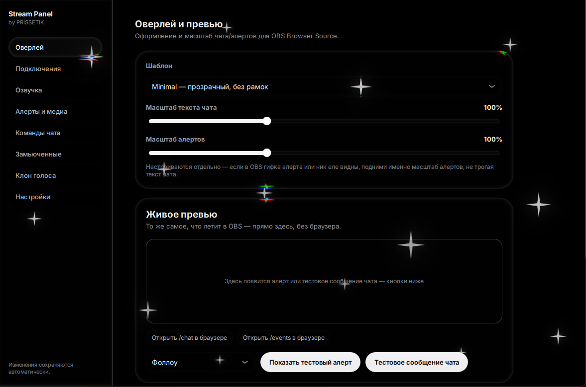
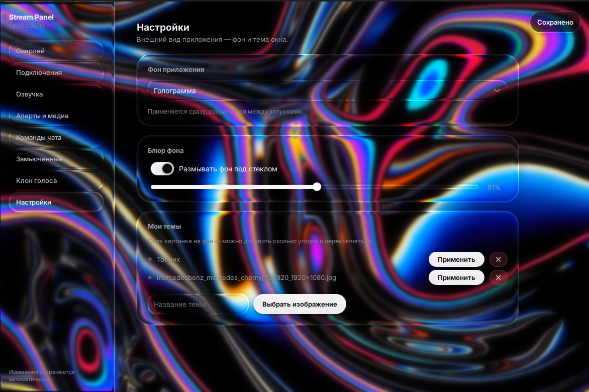

<div align="center">


# StreamSoft
</div>

Нативный стрим-ассистент для Windows: чат из Twitch и YouTube, алерты, оверлей для
OBS, озвучка сообщений, смена голоса — без Python, без консоли, без ручной настройки
Browser Source.

## Возможности

- Чат Twitch (IRC) и YouTube Live в одном оверлее для OBS
- Алерты на фоллоу, подписку, рейд, донат (Twitch EventSub)
- Пересылка чата и алертов в Telegram, управление ботом из Telegram
- Озвучка сообщений (TTS) и смена голоса (RVC) — устанавливаются отдельно, по кнопке
- Автоматическое подключение источников в OBS
- Статус в Discord (Rich Presence)
- Трей, автозапуск с Windows, обычный установщик без прав администратора

## Скриншоты

<table>
<tr>
<th>Оверлей и превью</th>
<th>Настройки внешнего вида</th>
</tr>
<tr>
<td></td>
<td></td>
</tr>
</table>

## Установка

Скачать `StreamSoftSetup.exe` из [Releases](../../releases) и запустить мастер
установки. Права администратора не требуются — программа ставится в
`%LOCALAPPDATA%\Programs\StreamSoft`.

> **Windows SmartScreen напишет «Windows защитил ваш ПК»** — это нормально для
> любого установщика без платной цифровой подписи, а не признак вируса. Нажмите
> **«Подробнее»** → **«Выполнить в любом случае»**. Предупреждение пропадёт
> само по себе, когда у релиза наберётся достаточно репутации в SmartScreen.

## Требования

- Windows 10/11 (x64)
- Для клона голоса (RVC) — видеокарта Nvidia с поддержкой CUDA

## Архитектура

- `core/` — фоновый сервис на C++20: чат-воркеры, веб-сервер оверлея, интеграция с
  OBS, Discord Rich Presence. Без зависимости от Python.
- `gui/` — интерфейс настроек на Qt Quick (QML), общается с `core` по локальному
  REST API.
- `adapters/tts`, `adapters/rvc` — опциональные Python-модули (единственное место,
  где используется Python: озвучка через `edge-tts`, смена голоса через
  `rvc-python`), скачиваются отдельно через кнопку «Установить» в настройках.

## Сборка из исходников

См. [docs/BUILD.md](docs/BUILD.md).

## Сборка установщика

Требуется [Inno Setup 6](https://jrsoftware.org/isinfo.php).

```powershell
.\build_installer.bat
```

Результат: `installer\Output\StreamSoftSetup.exe`.
